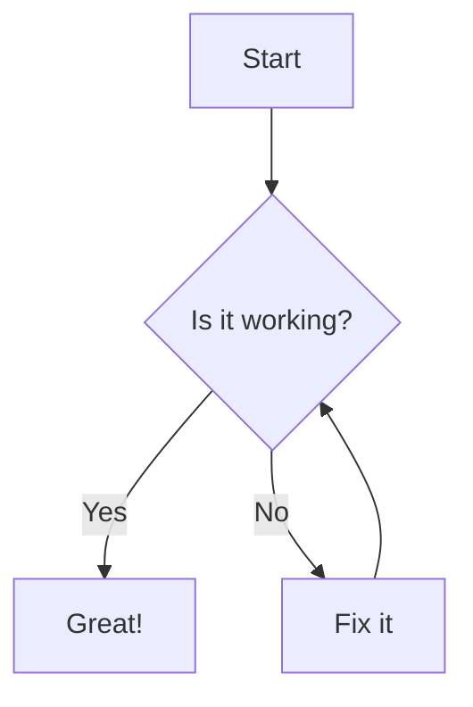
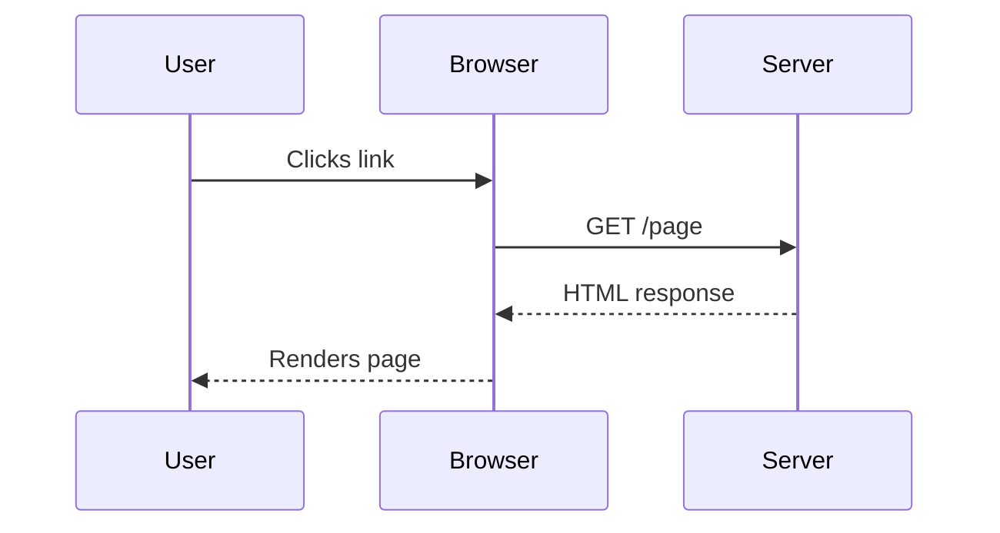

This page demonstrates every markdown feature rendered on Ryze. Use it as a reference when writing your own posts. All code blocks are highlighted with **Shiki**, math renders via **KaTeX**, external links open in new tabs, and images get automatic captions from `alt` text.


## Headings

## Heading 2 - `h2`
### Heading 3 - `h3`
#### Heading 4 - `h4`

Each heading has an auto-generated anchor link (the `#` symbol that appears on hover). Click it to copy a direct URL to that section.


## Text Formatting

**Bold text** using `**double asterisks**`.

*Italic text* using `*single asterisks*`.

***Bold and italic*** using `***triple asterisks***`.

~~Strikethrough~~ using `~~double tildes~~`.

<mark>Highlighted text</mark> using `<mark>` HTML tags.

<abbr title="Cascading Style Sheets">CSS</abbr> - hover over abbreviations to see the full title.

Press <kbd>Ctrl</kbd> + <kbd>C</kbd> to copy, or <kbd>Cmd</kbd> + <kbd>K</kbd> to open the command palette.


## Links

[Internal link to the home page](/)

[External link to Astro's docs](https://docs.astro.build) - opens in a new tab with `rel="nofollow noopener noreferrer"`.


## Lists

### Unordered

- Item one
- Item two
  - Nested item A
  - Nested item B
- Item three

### Ordered

1. First step
2. Second step
   1. Sub-step A
   2. Sub-step B
3. Third step

### Task Lists

- [x] Write the markdown showcase
- [x] Install remark and rehype plugins
- [ ] Add a dark mode toggle
- [ ] Publish the blog post


## Blockquotes

> This is a standard blockquote. It uses a left border and muted text colour to distinguish it from body content.

> A longer blockquote that spans multiple lines to show how line wrapping behaves within the blockquote component. The styling includes consistent padding, a left border, and appropriate spacing from surrounding elements.


## Inline Code

Use the `Array.prototype.map()` method to transform arrays. Variable names like `config`, `theme`, and `backgroundColor` are rendered with the Shiki inline code style - dark background in light mode, light background in dark mode.


## Code Blocks

### Python

```python
from datetime import datetime, timedelta

def generate_date_range(start: str, days: int) -> list[str]:
    start_date = datetime.strptime(start, "%Y-%m-%d")
    return [
        (start_date + timedelta(days=i)).strftime("%Y-%m-%d")
        for i in range(days)
    ]

print(generate_date_range("2026-05-01", 7))
# Output: ['2026-05-01', '2026-05-02', ..., '2026-05-07']
```

### JSX / TSX

```tsx
import { useState } from "react";

interface CounterProps {
  initial?: number;
}

export default function Counter({ initial = 0 }: CounterProps) {
  const [count, setCount] = useState(initial);

  return (
    <div className="counter">
      <p>Count: {count}</p>
      <button onClick={() => setCount((c) => c + 1)}>Increment</button>
    </div>
  );
}
```

### CSS

```css
.container {
  display: grid;
  grid-template-columns: repeat(auto-fill, minmax(300px, 1fr));
  gap: 1.5rem;
  padding: 2rem;
}

.card {
  border: 1px solid var(--border);
  border-radius: var(--radius);
  padding: 1.5rem;
  transition: box-shadow 0.2s ease;
}

.card:hover {
  box-shadow: 0 4px 12px rgba(0, 0, 0, 0.1);
}
```

### Go

```go
package main

import (
	"fmt"
	"time"
)

func main() {
	now := time.Now()
	fmt.Printf("Current time: %s\n", now.Format(time.RFC1123))
}
```


## Diagrams

Fenced code blocks tagged with `mermaid` are rendered as interactive SVG diagrams by [Mermaid.js](https://mermaid.js.org). The theme automatically switches between light and dark to match your site's appearance.

### Flowchart



### Sequence Diagram




## Tables

| Feature | Plugin | Status |
|---------|--------|--------|
| Heading anchors | `rehype-slug` + `rehype-autolink-headings` | Active |
| External link handling | `rehype-external-links` | Active |
| Math rendering | `remark-math` + `rehype-katex` | Active |
| Automatic figure captions | `rehype-figure` | Active |
| Syntax highlighting | Shiki (built-in) | Active |
| Mermaid diagrams | `astro-mermaid` | Active |


## Images


The image above is wrapped in a `<figure>` element by `rehype-figure`, with the `alt` text rendered as a `<figcaption>` below the image.


## Mathematics

### Inline Math

The quadratic formula $x = \frac{-b \pm \sqrt{b^2 - 4ac}}{2a}$ solves $ax^2 + bx + c = 0$.

Euler's identity: $e^{i\pi} + 1 = 0$.

### Display Math

$$
\int_{-\infty}^{\infty} e^{-x^2} \, dx = \sqrt{\pi}
$$

$$
\sum_{k=1}^{n} k = \frac{n(n+1)}{2}
$$

$$
\begin{pmatrix}
a & b \\
c & d
\end{pmatrix}^{-1}
= \frac{1}{ad - bc}
\begin{pmatrix}
d & -b \\
-c & a
\end{pmatrix}
$$


## Details and Summary

<details>
<summary>Click to reveal implementation notes</summary>

This is hidden content inside a `<details>` element. You can use these for spoilers, collapsible code explanations, or supplementary information that doesn't need to be visible upfront.

- The `<details>` element is native HTML
- No JavaScript required
- Styled to match the blog's border and spacing tokens

</details>


## Mixed Content Example

### A Tip for Writers

> Good documentation is not written in hindsight - it's written alongside the code.

When documenting APIs, include **concrete examples** in every section. Users rarely read prose top-to-bottom; they scroll to the code block first, then scan the surrounding explanation.

```javascript
// Bad: no example
// The authenticate function validates credentials.

// Good: example included
// The authenticate function validates credentials.
const user = await authenticate("admin@example.com", "s3cret");
console.log(user.role); // "admin"
```

This approach - a short blockquote for emphasis, bold for key terms, and a side-by-side code comparison - keeps readers engaged and learning faster.


## What You Can Do With Plugins

All the features on this page are powered by a small set of remark/rehype plugins configured in `astro.config.mjs`:

- **`rehype-external-links`** - opens external links in a new tab with security attributes
- **`remark-math`** + **`rehype-katex`** - renders $LaTeX$ math expressions
- **`rehype-figure`** - wraps images in semantic `<figure>` elements with captions
- **`astro-mermaid`** - renders ` ```mermaid ` code blocks as SVG diagrams via Mermaid.js
- **Shiki** - syntax highlights every fenced code block with the `github-dark` theme
- **GFM** (built-in) - tables, task lists, strikethrough, and autolinks

To add any of these to your own posts, just write standard markdown - the plugins handle the rest at build time.
